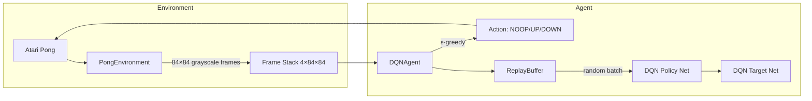
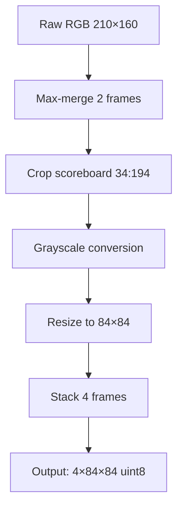
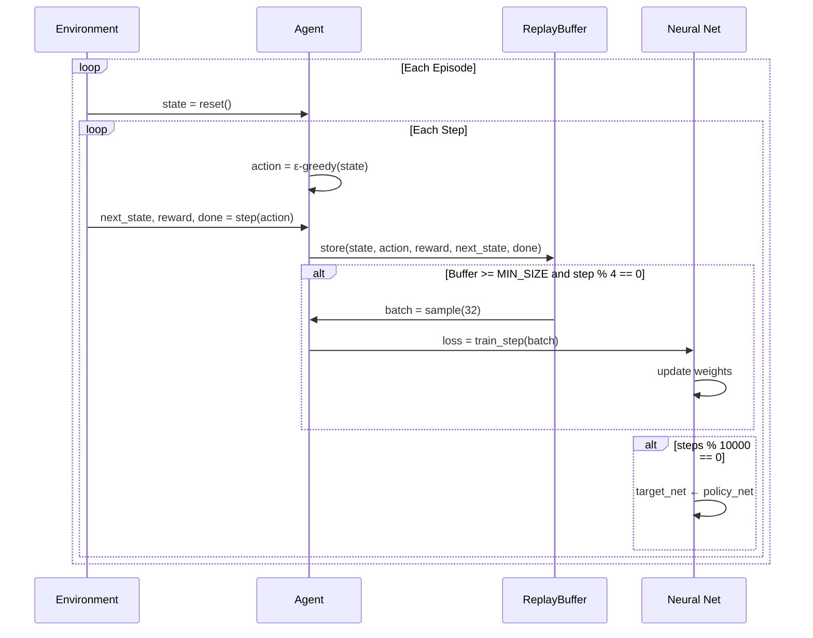

# 🧠 Pong AI Architecture & Code Reference

A comprehensive technical reference for the Deep Q-Network (DQN) Pong AI implementation.

---

## 📁 Project Structure Overview

```
pong-ai/
├── main.py            # CLI entry point (train/play/test/reset/export commands)
├── train.py           # Headless training loop with progress tracking
├── train_visual.py    # Visual training with live game + graph windows
├── play.py            # Watch trained agent play (visualization mode)
├── evaluate.py        # Evaluation modes (watch, benchmark, record-eval)
├── agent.py           # DQNAgent class - epsilon-greedy learning agent
├── model.py           # DQN neural network (CNN architecture)
├── environment.py     # PongEnvironment wrapper (preprocessing, frame stacking)
├── replay_buffer.py   # ReplayBuffer for experience replay
├── recorder.py        # TrainingRecorder for video capture + graph rendering
└── checkpoints/       # Saved models, training data, and videos
```

---

## 🔄 Data Flow Diagram



---

## 📦 Core Classes

### 1. `DQN` (model.py)

The **Convolutional Neural Network** that learns Q-values for each action.

#### Architecture

| Layer | Type | Input | Output | Notes |
|-------|------|-------|--------|-------|
| conv1 | Conv2d | 4×84×84 | 32×20×20 | 8×8 kernel, stride=4 |
| conv2 | Conv2d | 32×20×20 | 64×9×9 | 4×4 kernel, stride=2 |
| conv3 | Conv2d | 64×9×9 | 64×7×7 | 3×3 kernel, stride=1 |
| fc1 | Linear | 64×7×7=3136 | 512 | Flatten → Dense |
| fc2 | Linear | 512 | 3 | Q-values for each action |

```python
class DQN(nn.Module):
    def __init__(self, n_actions: int = 3)
    def forward(self, x: torch.Tensor) -> torch.Tensor
```

#### Key Details

- **Input**: `(batch, 4, 84, 84)` - 4 stacked grayscale frames, normalized to [0,1]
- **Output**: `(batch, 3)` - Q-values for NOOP, UP, DOWN
- **Initialization**: Orthogonal weights with ReLU gain (DeepMind standard)
- **Activation**: ReLU after each conv/fc layer (except output)

---

### 2. `DQNAgent` (agent.py)

The **learning agent** that implements the DQN algorithm with Double DQN improvement.

```python
class DQNAgent:
    def __init__(
        self,
        n_actions: int = 3,
        learning_rate: float = 1e-4,
        gamma: float = 0.99,
        epsilon_start: float = 1.0,
        epsilon_end: float = 0.01,
        epsilon_decay: int = 100000,
        buffer_capacity: int = 100000,
        batch_size: int = 32,
        target_update_freq: int = 1000,
        device: str = "cpu"
    )
```

#### Core Methods

| Method | Description |
|--------|-------------|
| `select_action(state, training)` | ε-greedy action selection |
| `store_transition(...)` | Add experience to replay buffer |
| `train_step()` | Sample batch, compute TD loss, backprop |
| `get_epsilon()` | Current exploration rate (linear decay) |
| `save(path)` / `load(path)` | Checkpoint persistence |

#### Algorithm: Double DQN

```python
# 1. Sample random batch from replay buffer
states, actions, rewards, next_states, dones = buffer.sample(batch_size)

# 2. Current Q-values: Q(s, a) from policy network
current_q = policy_net(states).gather(1, actions)

# 3. DOUBLE DQN: Policy net selects action, target net evaluates
next_actions = policy_net(next_states).argmax(dim=1)        # Action selection
next_q = target_net(next_states).gather(1, next_actions)    # Q-value estimate

# 4. Bellman target: r + γ * Q_target(s', argmax_a Q_policy(s', a))
target_q = rewards + (1 - dones) * gamma * next_q

# 5. Minimize Huber loss between current_q and target_q
loss = SmoothL1Loss(current_q, target_q)
```

#### Epsilon Decay

```
ε = max(ε_end, ε_start - progress × (ε_start - ε_end))

where progress = min(1.0, steps_done / epsilon_decay)
```

- **Linear decay** from 1.0 → 0.01 over 100,000 steps
- High exploration early, exploitation dominates later

---

### 3. `PongEnvironment` (environment.py)

**Atari wrapper** that handles frame preprocessing for the neural network.

```python
class PongEnvironment:
    ACTION_MAP = {0: 0, 1: 2, 2: 3}  # Maps simplified → Atari actions
    CROP_TOP = 34
    CROP_BOTTOM = 194
    
    def __init__(self, render_mode: Optional[str] = None, frame_stack: int = 4)
    def reset(self) -> np.ndarray
    def step(self, action: int) -> Tuple[np.ndarray, float, bool, bool, dict]
```

#### Preprocessing Pipeline



| Step | Purpose |
|------|---------|
| **Max-frame merge** | Handle Atari's sprite flickering (objects appear on alternate frames) |
| **Crop** | Remove scoreboard at top, focus on play area |
| **Grayscale** | Reduce dimensionality (color not needed for Pong) |
| **Resize 84×84** | Standard DQN input size |
| **Stack 4 frames** | Provide velocity/motion information |

#### Action Space

| Index | Simplified | Atari Action |
|-------|------------|--------------|
| 0 | NOOP | 0 (NOOP) |
| 1 | UP | 2 (UP) |
| 2 | DOWN | 3 (DOWN) |

#### Key Features

- **Frameskip = 4**: One agent decision per 4 game frames (faster training)
- **Deterministic**: `repeat_action_probability=0.0`
- **FIRE on reset**: Immediately starts game (avoids opponent-serve delay)
- **Memory efficient**: Returns `uint8` states (0-255), normalized to [0,1] at inference

---

### 4. `ReplayBuffer` (replay_buffer.py)

**Circular buffer** for storing and sampling experiences.

```python
class ReplayBuffer:
    def __init__(self, capacity: int = 100000)
    def push(self, state, action, reward, next_state, done)
    def sample(self, batch_size: int) -> Tuple[np.ndarray, ...]
    def __len__(self) -> int
```

#### Data Format

Each transition is stored as:

```python
(state, action, reward, next_state, done)
# Types: (uint8[4,84,84], int, float, uint8[4,84,84], bool)
```

#### Memory Optimization

- **uint8 storage**: States stored as 0-255 (4× less RAM than float32)
- **Deque maxlen**: Oldest experiences automatically discarded when full
- **Random sampling**: Breaks temporal correlation for stable learning

#### Why Experience Replay?

1. **Decorrelation**: Consecutive game frames are highly correlated → biased gradients
2. **Efficiency**: Each experience can be reused many times
3. **Stability**: Smooths out transitions in the training distribution

---

### 5. `TrainingRecorder` (recorder.py)

**Video capture system** for recording training sessions with live graphs.

```python
class TrainingRecorder:
    def __init__(
        self,
        checkpoint_dir: str = "checkpoints",
        frame_skip: int = 4,       # Save every Nth frame
        buffer_size: int = 300     # RAM buffer before disk flush
    )
    
    def start(self)                # Begin/resume recording
    def add_frame(game_frame)      # Capture game frame
    def update_graph(episode, reward, avg_reward, epsilon, steps)
    def export_video(output_path, fps, quality, layout, limit)
    def save() / close()
```

#### Features

- **Async disk writes**: Background thread prevents blocking training
- **Batch subdirectories**: Organizes frames in batches of 10,000 for NTFS performance
- **State persistence**: Resume recording across training sessions
- **Graph overlay**: Matplotlib-rendered performance graphs

#### Video Layouts

| Layout | Description |
|--------|-------------|
| `side-by-side` | Game on left, graph on right |
| `game-only` | Full-frame game footage |
| `graph-only` | Performance graph only |

---

## 🏋️ Training System

### Training Flow (train.py)



### Hyperparameters (DeepMind Standard)

| Parameter | Value | Description |
|-----------|-------|-------------|
| `learning_rate` | 0.00025 | RMSprop learning rate |
| `gamma` | 0.99 | Discount factor |
| `epsilon_start` | 1.0 | Initial exploration |
| `epsilon_end` | 0.1 | Final exploration |
| `epsilon_decay` | 250,000 | Steps for ε decay |
| `buffer_capacity` | 1,000,000 | Replay buffer size |
| `batch_size` | 32 | Training batch size |
| `target_update_freq` | 10,000 | Target net sync frequency |
| `MIN_REPLAY_SIZE` | 50,000 | Warmup before training |
| `TRAIN_FREQUENCY` | 4 | Train every N steps |

### Key Training Features

1. **Warmup period**: No training until 50K samples collected
2. **Reward clipping**: All rewards clipped to [-1, 1]
3. **Episodic lives**: Point scored = terminal transition (for learning only)
4. **Gradient clipping**: Max norm = 1.0 for stability
5. **Checkpoint resume**: Training continues from last save

---

## 📊 Evaluation Modes (evaluate.py)

| Mode | Command | Description |
|------|---------|-------------|
| **watch** | `python main.py watch` | Game window + live graph |
| **benchmark** | `python main.py benchmark` | Fast terminal-only eval |
| **record-eval** | `python main.py record-eval` | High-quality video recording |
| **versus** | `python main.py versus` | Human vs AI mode |

### Evaluation Settings

- **Epsilon = 0.0**: Pure exploitation (no random actions)
- **30 random no-ops**: Standard evaluation startup (record-eval)
- **No training**: Weights frozen, buffer unused

---

## 🔧 CLI Commands (main.py)

```bash
# Training
python main.py train [--episodes N] [--record]
python main.py train-visual [--episodes N] [--record]

# Evaluation
python main.py play [--checkpoint PATH] [--episodes N]
python main.py watch [--checkpoint PATH] [--episodes N]
python main.py benchmark [--checkpoint PATH] [--episodes N]
python main.py versus [--checkpoint PATH]
python main.py record-eval [--checkpoint PATH]

# Utilities
python main.py test          # Verify environment setup
python main.py reset [--all] # Delete training data
python main.py export-video [--fps N] [--quality Q] [--layout L]
```

---

## 🧪 How the AI Learns

### 1. Exploration vs Exploitation

```
Episode 1-100:    ε ≈ 1.0    → 100% random actions (exploring)
Episode 100-300:  ε ↓ 0.5    → 50% random, 50% learned
Episode 300-500:  ε ↓ 0.1    → 10% random, 90% learned
Episode 500+:     ε = 0.1    → Mostly exploiting learned policy
```

### 2. Q-Value Learning

The network learns to predict **expected future rewards** for each action:

```
Q(state, UP) = 0.7     → "Moving UP here typically leads to +0.7 total reward"
Q(state, DOWN) = -0.3  → "Moving DOWN here typically leads to -0.3 total reward"
Q(state, NOOP) = 0.1   → "Doing nothing here leads to +0.1 reward"

Best action = argmax(Q) = UP
```

### 3. Temporal Difference Learning

Each training step minimizes the **Bellman error**:

```
TD Error = Q(s,a) - [r + γ × max Q(s',a')]
                     ↑           ↑
            immediate     discounted future
              reward         reward
```

### 4. Target Network Stability

- **Problem**: Q-values we're learning towards are themselves changing
- **Solution**: Use a **frozen copy** (target network) for computing targets
- **Update**: Copy policy → target every 10,000 steps

---

## 📈 Expected Learning Progression

| Episodes | Behavior | Avg Reward |
|----------|----------|------------|
| 1-100 | Random, no ball tracking | -21 to -19 |
| 100-300 | Begins tracking ball | -18 to -10 |
| 300-500 | Defensive positioning | -10 to -5 |
| 500-1000 | Returning serves | -5 to +5 |
| 1000+ | Aggressive play, winning | +10 to +21 |

---

## 📚 References

- [DeepMind DQN Paper (2015)](https://www.nature.com/articles/nature14236) - Original algorithm
- [Double DQN](https://arxiv.org/abs/1509.06461) - Reduces overestimation bias
- [OpenAI Gymnasium](https://gymnasium.farama.org/) - Environment framework
- [PyTorch](https://pytorch.org/) - Neural network library
